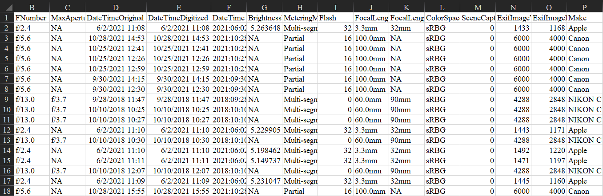

## Metadata Extractor

The exif_extract script can be used to read in exif metadata from all .jpg images in a given directory location and save the formattted result to a .csv file. This program extracts a pre-specified number of relevant exif tags (fields) for each image read.

Below is an example of the .csv output.

